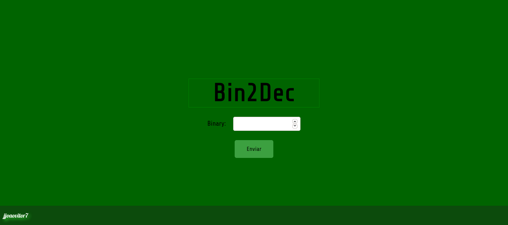

# Bin2Dec
<p align="center">
  
</p>

<p align="center">
  <a href="https://forthebadge.com">  </a>
  <a href="https://forthebadge.com">  </a>
  <a href="https://forthebadge.com">  </a>
</p>


## :scroll: Sobre
Conversor de Binário para Decimal.

---


## :rocket: Tecnologias utilizadas
* HTML
* CSS
* JavaScript

---


## :computer: Como baixar o projeto
```bash
  // Clonar o repositório
  $ git clone https://github.com/jjoaovitor7/Bin2Dec

  // Entrar no diretório
  $ cd Bin2Dec
```

---
